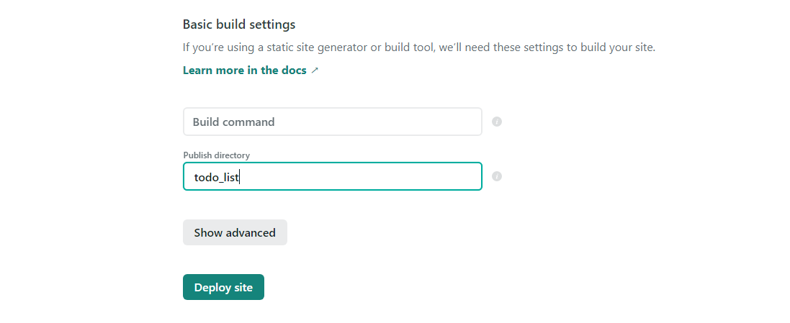

# Netlify를 이용한 배포

-   [Netlify 링크](https://www.netlify.com/)

1. 가입 - Github을 통해 가입하면 별도의 절차 필요 없었음. (Authorize만 진행)
2. 가입후 new site from git버튼 클릭.
   

3. (첫 시작 시에만 github 권한 등록 진행. 이후로 authorize 팝업 뜬 후 사라짐) Create a new site 메뉴 진입. Continuous Deployment의 github 클릭
4. 자동으로 수집된 내 깃헙 계정의 레포 중 배포할 레포 선택
5. branch 선택 및 경로 지정
    - 경로지정 ex)
      
    - todo-list라는 레포의 하위 디렉토리인 todo_list 안에 배포할 페이지들이 있는 상태.
    - 레포 이름을 제외한 최상위 디렉토리 이름까지 복사한다. (todo_list까지) , (마지막 슬래시는 제외함)
      
    - Deploy site 클릭
6. 문제 없이 배포가 진행되면 custom domain을 지정한다.
   
    - 복잡하게 되어있는 이름을 변경해주려면 사이트 클릭 - Domain settings 클릭 - options 클릭 - Edit site name
    - 이름 설정 후 저장

-   메인 메뉴의 Builds - 자신의 페이지 클릭 - 하단 Deploy log의 Preview클릭하면 배포하고 있는 사이트로 갈 수 있다.
