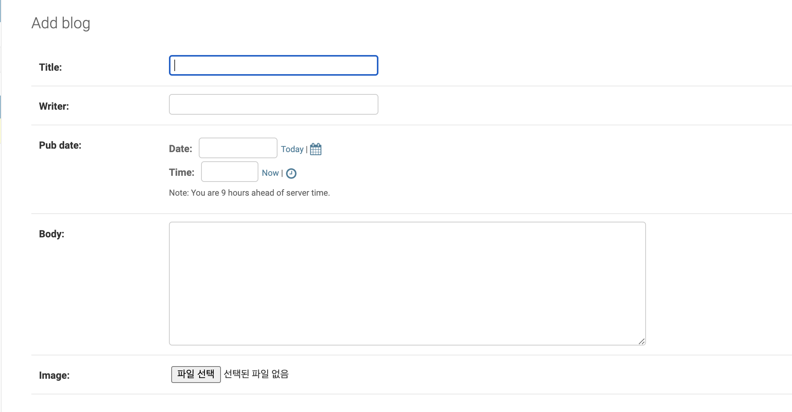

# media

- 웹은 URL을 통해 통신하기 때문에, 서버는 클라이언트에게 컨텐츠의 원본을 제공하는 것이 아니라, 컨텐츠가 저장되어 있는 URL을 제공한다.

- media 파일들을 모아주기
  1. project 디렉토리의 settings.py - static files 취급하는 곳에 코드 추가
  2. project 디렉토리의 urls.py에 media url관련하여 추가
  3. app의 models.py에 들어가서 imagefield추가하기 `image = models.ImageField("blog/")`

```python
# settings.py
MEDIA_ROOT = os.path.join(BASE_DIR, 'media')
# 이용자가 업로드한 파일을 모아두는 곳
MEDIA_URL = '/media/'
# media파일에 설정한 URL
```

```python
from django.contrib import admin
from django.urls import path, include
from blog.views import *
from django.conf import settings # new import
from django.conf.urls.static import static # new import

urlpatterns = [
    path('admin/', admin.site.urls),
    path('',home,name="home" ),
    path('blog/', include('blog.urls'))

] + static(settings.MEDIA_URL, document_root=settings.MEDIA_ROOT) # media url을 병렬적으로 연결
```

```python
# models.py
class Blog(models.Model):
    title = models.CharField(max_length=200)
    writer = models.CharField(max_length=100)
    pub_date = models.DateTimeField()
    body = models.TextField()
    image = models.ImageField(upload_to = "blog/", blank = True, null= True)
```

- upload_to : 업로드할 폴더를 지정. -> settings.py에 MEDIA_URL로 지정해둔 media폴더 안에 blog폴더를 만들어서 관리하는 설정
- models.py의 테이블에 원본 사진이 아닌 URL이 저장되며, blank, null 옵션을 추가하여 사진은 올리지 않고 글만 올린 경우를 무시할 수 있음.
- 기존 모델에 변경이 있을 경우 이전에 저장되어있던 데이터들을 처리하는데에 오류가 발생함 - 기존의 테스트 데이터를 삭제하고 다시 시작하는 것이 방법 중 하나. (column이 추가되기 때문에 기존의 데이터 처리에 문제)

- 기존 데이터 삭제법
  - blog app의 migration폴더의 inital파일 삭제
  - db.sqlite도 삭제
- 이후 makemigration을 진행.

- makemigration 처리 전 파이썬 모듈을 통해 이미지 처리를 정상적으로 진행해야함.

  - `pip install pillow`

- 이후 절차
  1. `python manage.py makemigrations` -> 삭제했던 app폴더의 migration폴더에 initial파일들 생성 + db.sqlite
  2. `python manage.py migrate`

* 모델 확인을 위해 admin페이지로 진입하기
  _ `python manage.py createsuperuser` -> admin페이지 진입하게 해주는 계정을 생성
  _ 새로 생성한 image컬럼이 데이터베이스에 적용되었는지 확인하기!
  

* 파일 업로드 기능 구현하기
  - `<input type="file" name="image"/>`
  - form태그의 enctype속성 추가 - `<form action=".." action=".." enctype="multipart/form-data"></form>`
