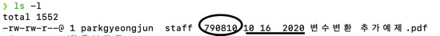

# 터미널사용법 (2)

-   명령어 -옵션 -인자
    -   `ls -l -a`... 옵션은 여러개 동시에 사용 가능
    -   pwd - print working directory : 현재 디렉토리 위치 출력
    -   man - manual : 명령어 설명서 `man pwd` - 알고싶은 명령어 출력
    -   ls - list : 디렉터리 목록을 알려줌
        -   옵션 a : 숨김파일까지 보여줌
        -   옵션 l : 상세하게 보여줌
        -   옵션 F : 파일인지 디렉터리인지 알려줌
    -   `ls /`를 통해 루트 디렉터리의 하위 디렉터리 목록 확인
    -   `cd ..` - change directory : 디렉터리 이동
    -   `clear` - 터미널 청소기
    -   `history` - 입력했던 명령어들 목록 확인

-   790810이 용량, 10 16 2020은 파일의 마지막 수정 날짜
