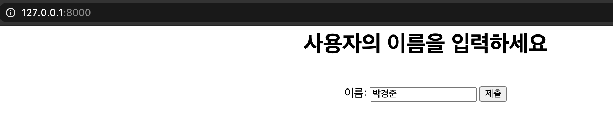
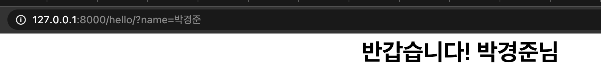

# Django 실습[1]

- 웹사이트 구동순서
  1. 사용자가 서버에 요청
  2. 서버의 view는 model에게 요청에 필요한 데이터를 받음
  3. view는 받은 데이터를 적절히 처리하여 template에게 넘김
  4. template은 받은 정보를 사용자에게 보여줌

## 실습 흐름 정리

1. APP생성
2. template 제작(html)
3. View 제작 (views.py)
4. URL연결

### APP생성

1. `python manage.py startapp appname` - appname이름으로 앱 폴더가 자신의 프로젝트 하위에 생성됨
2. 자신의 앱이라는 것을 표시 (project폴더/settings.py - INSTALLED_APPS에 추가)
   - `'appname.apps.AppnameConfig',` (콤마 및 세번째 이름 작성 규칙에 주의)

### template 제작(html)

- 생성된 app폴더 하위에 html을 담을 폴더 생성 및 html생성

### views제작

1. app폴더 하위에 views.py진입 - 파이썬 함수식으로 작성

```python
def welcome(request):
    return render(request,"welcome.html")
```

- 외부에서 welcome함수를 요청할 시 render함수를 통해 welcome.html을 띄워준다는 의미

* html의 input박스로부터 값 가져오는 함수

```python
def hello(request):
    userName = request.GET['name']
# html input박스의 name속성의 값을 확인하여 가져옴
```

- GET뒤에 대괄호임!!!

### URL과 view연결

- 사용자가 웹을 이용할 때에 html파일을 직접 호출하지 않음. (URL을 통해 이동) -> view와 URL을 연결해야함!!
- project폴더/urls.py - 자신의 views.py를 urls.py에서 사용할 수 있게 import 해와야함.

```python
"""firstproject URL Configuration

The `urlpatterns` list routes URLs to views. For more information please see:
    https://docs.djangoproject.com/en/3.2/topics/http/urls/
Examples:
Function views
    1. Add an import:  from my_app import views
    2. Add a URL to urlpatterns:  path('', views.home, name='home')
Class-based views
    1. Add an import:  from other_app.views import Home
    2. Add a URL to urlpatterns:  path('', Home.as_view(), name='home')
Including another URLconf
    1. Import the include() function: from django.urls import include, path
    2. Add a URL to urlpatterns:  path('blog/', include('blog.urls'))
"""
from django.contrib import admin
from django.urls import path
from firstapp import views

urlpatterns = [
    path('admin/', admin.site.urls),
    path('',views.welcome, name="welcome"),
    path('hello/',views.hello, name="hello"),
]

```

- 새로운 path를 추가하면됨.
  1. parameter1 - URL (아무것도 적지 않을 경우 서버 기동시 가장 처음 등장하는 페이지라는 의미)
  2. parameter2 - 연결할 view이름 (views.py의 welcome함수)
  3. parameter3 - name인자 추가를 통해 다른 html파일에서 URL을 매번 입력하는 대신 name을 사용하여 불러올 수 있음.

* [django request&response objects](https://docs.djangoproject.com/en/3.2/ref/request-response/)
  > Django uses request and response objects to pass state through the system. When a page is requested, Django creates an HttpRequest object that contains metadata about the request. Then Django loads the appropriate view, passing the HttpRequest as the first argument to the view function. Each view is responsible for returning an HttpResponse object.




# 실습[2]

- url과 views 연결시 서로 다른 앱에서 같은 view이름을 가진 파일을 import해야하는 상황
  1. from을 쓰지 않고, `import firstapp.views`
     - 이후 url연결시 path내에도 `path('', firstapp.views.welcome,name="name")` 앱 이름까지 작성해줘야함
  2. import as이용
     - `from firstapp import views as first`
     - `from firstapp import views as second`

* 템플릿 언어 - html에서 파이썬 변수와 문법을 사용하게 해주는 언어
* [참고자료 - 로직처리 및 반복문 참고](https://velog.io/@hidaehyunlee/Django-%ED%85%9C%ED%94%8C%EB%A6%BF-%EC%96%B8%EC%96%B4)
